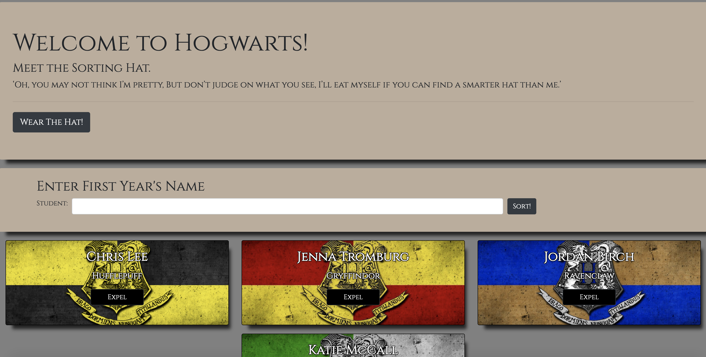
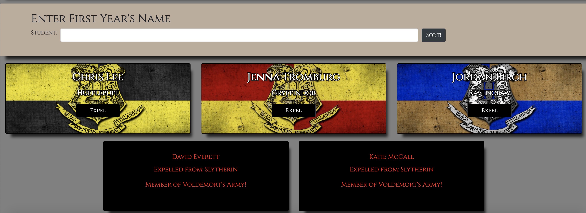

# sorting-hat

## Description
This application mimics the Sorting Hat from the Harry Potter franchise, hence the name.  On page load, the user will see a bootstrap jumbotron, with text welcoming them to the page, a quote by the Sorting Hat from the book, and a button prompting the user to wear the hat.  Clicking this button will display another panel containing a form in which the user will type in a name.  After typing in a name and clicking the "Sort!" button, a card will appear below containing the name, a randomly selected Hogwarts house, and a button with the option to expel the student.  The user may continue entering names, and similar cards will continue to appear in a flex-wrap fashion below.  If the user decides to expel a student, the card will disappear from the initial flex container of cards, and appear in a separate flex container below with red text declaring the expulsion, and a black background.  This page also displays responsiveness on many different screen sizes, from cell phones to large monitors.
## Screenshots

## How To Run
1. Clone down this repository.
2. Make sure you have http-server installed via npm.  If not get it [HERE](https://www.npmjs.com/package/http-server)
3. On the command line, run `hs -p 8080`.
4. In your browser, to go `http://localhost:8080`.